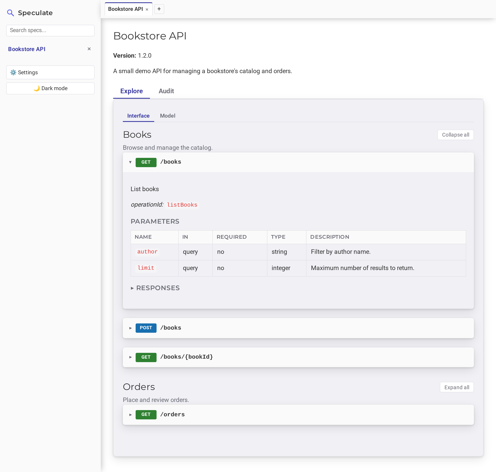

<p align="center">
  
</p>

# Areté

Areté — the pursuit of API excellence.

**[Documentation &rarr;](https://johnjoeallen.github.io/arete/)**

Areté is a local-first API explorer for OpenAPI/Swagger specs. Paste a
spec, or point Areté at one on disk, and get instant browsable docs —
endpoints, parameters, schemas, request/response examples, and pluggable
policy-driven scoring — with search, multi-spec tabs, and light/dark
themes. No cloud, no build step for the reader, no account: it's a single
runnable jar that keeps its data under `~/.arete` on your machine.

<p align="center">
  
</p>

## Quick start

Download the latest `arete-<version>.zip` from the
[releases page](../../releases), unzip it, and run the launcher for your
platform:

```bash
unzip arete-<version>.zip -d arete   # the zip has no top-level folder
cd arete
./arete.sh        # Linux/macOS
arete.bat         # Windows
```

Then open <http://localhost:6809>.

### From source

Requires Java 17+ and Maven.

```bash
mvn clean package        # or ./build.sh — also copies the app jar to scripts/arete.jar
./scripts/arete.sh
```

### Build and install the zip locally

```bash
mvn clean verify
VERSION=$(mvn -q help:evaluate -Dexpression=project.version -DforceStdout)
rm -rf dist && mkdir -p dist/arete
cp arete-app/target/arete-$VERSION.jar dist/arete/arete.jar
cp arete-cli/target/arete-cli-$VERSION.jar dist/arete/arete-cli.jar   # optional
cp scripts/arete.sh scripts/arete.bat dist/arete/
chmod +x dist/arete/arete.sh
(cd dist/arete && zip -r ../../arete-$VERSION.zip .)

unzip arete-$VERSION.zip -d ~/arete && cd ~/arete && ./arete.sh
```

Open <http://localhost:6809>. Data lives in `~/.arete`, so upgrading is just
unzipping a newer zip over the old folder.

### Build and install the Maven and Gradle plugins locally

```bash
mvn clean install -DskipTests    # installs the engine and both plugins into ~/.m2
```

Maven, in the project to check:

```bash
mvn net.dublinux.arete:arete-maven-plugin:0.1.0-SNAPSHOT:gate -Darete.target=origin/main
```

Gradle: add `mavenLocal()` to `pluginManagement.repositories` in
`settings.gradle` and use `id 'net.dublinux.arete' version '0.1.0-SNAPSHOT'`.
Full snippets are in
[Getting Started](https://johnjoeallen.github.io/arete/getting-started/) and
[Maven and Gradle](https://johnjoeallen.github.io/arete/build-plugins/).

Common flags: `--port PORT` / `-p PORT`, `--wipe-db`, `-h`. The launcher
respects `JAVA_HOME`. See
[Configuration](https://johnjoeallen.github.io/arete/configuration/) for
the full list.

## Scoring

Scoring is on-demand: open a spec, pick a plugin and policy in the
**Scoring** panel, and click **Score**. Findings are merged per
endpoint with severity badges, JSON Pointer locations, and links to rule
docs.

The release bundles the **Areté Policy Engine**
(`arete-engine`) — a policy-driven linter whose matchers,
rules, and policies are plain text files, with matchers written in Distill,
a safe-by-construction expression language. It ships the Enterprise Grade,
Zalando, and Zalando Extended policies. Add your own policies under
`~/.arete/policies`.

- [Scoring overview](https://johnjoeallen.github.io/arete/scoring/)
- [Policy engine](https://johnjoeallen.github.io/arete/scoring/policy-engine/)
- [Distill reference](https://johnjoeallen.github.io/arete/scoring/distill/)
  — editor highlighting for VS Code / IntelliJ lives in [`editors/distill/`](editors/distill/)
- [Rule catalogue](https://johnjoeallen.github.io/arete/scoring/rules/)
  and [policies](https://johnjoeallen.github.io/arete/scoring/policies/)

## Modules

| Module | Purpose |
|---|---|
| `arete-engine-api` | The engine's public types (findings, scores, severities, spec input). Published to Maven Central. |
| `arete-engine` | The Areté Policy Engine: spec model, policy loading, Distill and scoring. A plain library with no Spring, database or UI. Published to Maven Central. |
| `arete-cli` | The `arete` command: score, diff and report specs, check a policy source. One runnable jar. |
| `arete-maven-plugin`, `arete-gradle-plugin` | `gate` and `score` in the build, in process, as thin wrappers over the engine. Published to Maven Central. |
| `arete-app` | The Spring Boot application, a local viewing and scoring UI over the engine. |

## Release

Pushing a tag matching `v*.*.*` runs
[`.github/workflows/release.yml`](.github/workflows/release.yml), which sets
the Maven version from the tag, builds, packages the zip, and publishes it
as a GitHub release, with the command line jar. The engine, its API and the
Maven and Gradle plugins go to Maven Central from
[`.github/workflows/publish.yml`](.github/workflows/publish.yml), run by hand
against a tag ([how](docs/publishing.md)). Docs are deployed to GitHub Pages by
[`.github/workflows/docs.yml`](.github/workflows/docs.yml).

## License

[Apache License 2.0](LICENSE).
