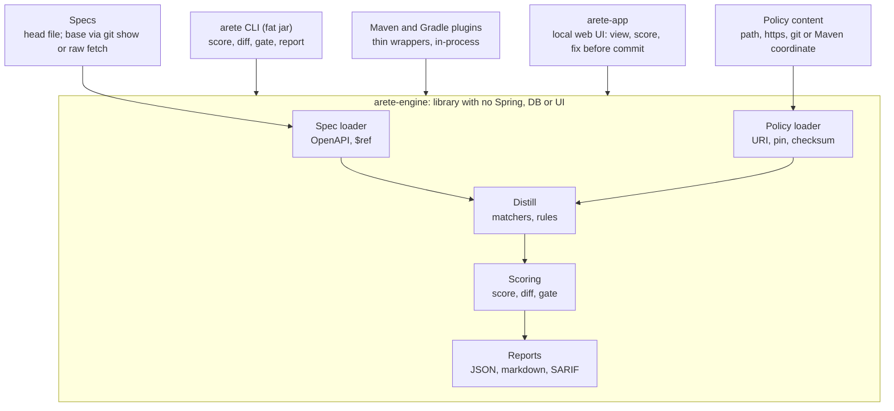

# Areté Serverless Core: Plan

2026-10-02

> **Status: the core is built; hardening and publishing remain.** Where the text below says what "will" happen, check this banner first: it is the record of what exists. Done on `merge/serverless-core`: false-positive and `$ref` fixes, the rule
> corpus and whole-API specs, Groovy removed, `arete-engine-api` / `arete-engine` split with a plain
> `Engine` class (no plugin SPI, no plugin jars, no global plugin settings). Also done: the policy
> loader (file, https and Maven sources with pin, checksum and cache; layering), `locked` rules and
> `.arete.yaml` overrides. Also done: the `arete` CLI (`score`, `diff`, `report`, `policy verify`) and the
> JSON, markdown and SARIF writers, with line numbers. Stable pointers too (parameters by `in:name`, responses
> by status, tags by name). The merge-gate (`arete gate`: git or raw base, reports, `--report-only`). The Maven (`arete:gate`, `arete:score`) and Gradle (`areteGate`, `areteScore`) plugins as thin wrappers over a shared `GateJob`. Rule semantics in the policy (`format: 2`: `expect: match`, `per-match`, `max`, `tiers`) with the gate comparing counts. Distill values: `occurrence(..., value)` with `measure: value` tiers, and the gate comparing the worst value (JSON025 nesting depth); coverage dropped as redundant, combinators and whole-spec scope deferred (see `distill-extensions.md`). App: the leftover "Plugin" names are renamed (package `scoring`, `EngineScoringService`, `SpecEngineSettings*`, `/engines/...`; the stored table and column are renamed too; the local database is disposable). Git policy sources (`git:<repo>#ref=..&path=..`, every pin optional). Retired `arete-ci-gate-*`; the engine, API and both plugins are publishable from `publish.yml` (not yet run), and the CLI, Maven plugin and Gradle plugin were tried from a local install on a real git repository (regression, new and moved specs, a layered `git:` policy, a shallow clone). Not started: signature checking and pinning hardening, the first real publish to Maven Central, hosting a policy bundle in-org, and the ideas marked *future* below.

## Goals and requirements

Areté becomes an embeddable policy-engine library first. The server and web UI become one consumer of it, so CI can score and gate an API spec with no running service.

- **No service in CI.** Scoring runs in-process on a build agent, writes result files and sets an exit code. Nothing is deployed, which removes the "approval to deploy a service" blocker.
- **Library-first core.** Spec parsing, `$ref` resolution, Distill, policy loading, scoring, diffing and report writing live in a library with no Spring, no database and no UI.
- **Thin wrappers.** We ship a Maven plugin and a Gradle plugin that only embed the library: no scoring logic, no service call. We also ship a CLI that can score one spec, diff two specs, or write a full markdown report. Anyone else can embed the library directly.
- **Policy from any URI.** Profiles (policies), rules and matchers load from a path, `https://`, `git+https://` or Maven coordinate, with a version pin and checksum. Org-specific standards live in an internal repo, apart from the public tool.
- **Merge-gate mode.** Compare the head spec with the spec at the merge-base (target branch configurable). Report new, existing and resolved findings. Fail CI on regression or a score below threshold.
- **The server stays.** The web UI is local developer tooling, as it is today: a viewing and scoring UI that helps a developer fix findings before they commit. It is a Spring app wrapping the same library and is never part of CI.
- **Small footprint.** The engine is a normal library jar with a modest dependency tree, because it runs on build agents.

## Target architecture



The CLI, third-party embedders and the server all call the same engine. The engine reads specs and policy content and writes reports; it never opens a port or a database.

## Core library and modules

This was an extraction and a rename, not a rewrite. `arete-engine` holds the policy loader, the Distill evaluator, the OpenAPI adapter, scoring, the gate and the report writers on `swagger-parser`, `snakeyaml` and `re2j`. `arete-app` holds Spring, JPA, H2 and Thymeleaf.

| Today | Becomes | Change |
| --- | --- | --- |
| `arete-engine-api` | `arete-engine-api` | Done: `Diagnostic`, `Severity`, `ScoringResult`, `SpecInput` and friends, without the plugin-discovery framing. `GateResult`, `ScoreReport` and `ScoreDiff` live in `arete-engine`. |
| `arete-engine` | `arete-engine` | Done: a plain `Engine` class is the entry point and the plugin interface is gone. Done: the loader takes URIs (next section). |
| `arete-ci-gate-core`, Maven and Gradle plugins | `arete-cli`, `arete-maven-plugin`, `arete-gradle-plugin` | Done: the HTTP client to a service is retired. The Maven and Gradle plugins and the CLI call the engine in-process. |
| `arete-app` | `arete-app` (not renamed) | Spring depends on `arete-engine`. Local developer UI: view and score specs, fix findings before commit. |

The public surface stays small and has no framework types:

```java
Engine engine = Engine.builder()
    .policySource("maven:org.acme:api-policy:2.3.1#sha256=...")
    .requirePin(true)
    .build();
ScoringResult result = engine.score(SpecInput.of(spec));     // one spec
GateResult gate = new GateJob(config).run();                  // the merge-gate (what the plugins call)
String md = ReportWriter.markdown(reports, true);             // also json(...), sarif(...), text(...)
```

**Dependency footprint.** The engine is published as a normal library jar with ordinary transitive dependencies, so embedders and build tools resolve them as usual. The old shaded jar was a leftover of the plugin design and is gone. Most of the engine's weight is `swagger-parser` and its dependencies (Guava, Jackson, HttpClient). Groovy is removed entirely: every bundled matcher has a Distill version. Shading is limited to where it is needed: the CLI is one fat jar (about 14 MB), and the Gradle plugin relocates Jackson, Guava and SnakeYAML so they cannot clash with other build plugins. The Maven plugin needs neither, because Maven isolates plugin classloaders.

**Rules for the engine module.** No Spring, no JPA, no servlet, no `System.exit`, no global state, no network except through the policy loader and an injectable `HttpClient`. Everything it reads comes through an interface (`SpecReader`, `PolicySource`), so tests and embedders can supply their own.

## Deep `$ref` and nested schemas

> **Partly done.** The `$ref` false positives are fixed with a regression corpus. Nested properties are walked with a depth and a guard (`nestingDepth` is in the model; JSON025 limits it). A finding on a shared definition is reported once, at the definition, with every route to it listed ("reached via"). Still *future*: the full resolved schema graph below (ref-to-ref chains, memoised cycle detection with a depth-limit finding, an `allOf` merged view), external relative refs resolved against the base commit, and a `$ref` chain length rule.

The problem as first found, in `OpenApiMapAdapter`:

- Parsing uses `setResolve(true)` but not `resolveFully`, so schema `$ref`s stay as stubs. Only `requestBodies` and `responses` refs are followed by hand.
- Component schemas expose their direct properties only. A property that is a `$ref` has no type, format or description in the model, so type and description rules can misfire on it.
- Nested properties, `items` schemas and `allOf`, `oneOf` and `anyOf` members are not walked. Items are just `itemsPresent`.
- There is no cycle detection, depth limit or memoisation, because nothing recurses.

The plan:

1. **A resolved schema graph.** Each schema node carries both views: the raw `$ref` (so inline-schema rules still work) and the resolved target. Resolution follows ref-to-ref chains, memoises by target, detects cycles and has a configurable depth limit. Hitting the limit raises a finding, never a silent truncation.
2. **Walk everything.** Properties recursively, `items`, `additionalProperties`, composition members (with an `allOf` merged view), and parameters, headers, responses and request bodies, including component refs.
3. **External refs.** Relative file and URL refs resolve against the spec's base. For the merge-gate the base spec must resolve against the base commit (`git show` for each referenced file, or the raw URL at the merge-base SHA), never the head checkout, or the comparison mixes versions.
4. **Report once, at the definition. Done.** A finding on a shared schema points at its definition pointer, with its "reached via" routes, so one defect reached through ten paths is one occurrence. This also keeps occurrence identity stable.
5. **Nesting rules.** Maximum schema nesting depth is done (JSON025, tiered on the measured value). Maximum `$ref` chain length is *future*.
6. **Tests.** A corpus with deep nesting, cycles, ref-to-ref chains and external files, run before any parity numbers are trusted.

## One mechanism and richer rule semantics

**Policy engine only.** The scoring-plugin mechanism goes: no plugin discovery, registry or per-plugin settings, and no second validator type. The policy engine is the only way a spec is scored, and the `arete-engine-api` types become the engine's own API. This is separate from the Maven and Gradle build plugins, which stay as thin wrappers.

**What a rule can say today.** A matcher finds problems. Any match is a violation, and the policy attaches either a flat deduction (charged once per rule, however many matches) or `PROHIBITED` (score forced to 0). Distill has no way to say "this must be present" or "deduct more for more matches".

**What we add.** Each rule entry in a policy can set:

| Setting | Meaning |
| --- | --- |
| `expect: no-match` | Default, as today. Matches are violations. |
| `expect: match` | Must match. No match is the violation, reported at the scope's pointer (the operation, schema or spec root), and costed by `points`, `per-match` or `tiers` like any other violation. |
| `points` | Flat deduction when the rule is violated, as today. |
| `per-match` and `max` | Deduct per match, capped at `max`. |
| `tiers` | Deduction by match count, for example 1 or more costs 1, 5 or more costs 3, 20 or more costs 8. |
| `PROHIBITED` | Unchanged. Any violation forces the score to 0. |

Built as proposed: a policy declares `format: 2` to use these, so existing policies keep their meaning. `tiers` can also be over a measured value (`measure: value`).

**Distill beyond simple matching.** Settled in `design-notes/distill-extensions.md`: counts and values are done; coverage was dropped as redundant; whole-spec scope and combinators are deferred until a real rule needs them; the resolved schema graph is the deep `$ref` work above. The original candidates:

- Matchers return counts and values as well as locations, so a rule can compare against a limit or across the whole spec.
- Whole-spec scope, for checks such as "at least one security scheme is defined" or "all list operations use the same pagination parameters".
- Combinators over matchers (all, any, not) so a rule can be built from smaller matchers without a new program.
- The resolved schema graph from the deep `$ref` work, so matchers see nested and referenced schemas.

**Effects on the gate.** A must-match failure reports at a stable scope pointer, so it has a normal occurrence identity. Count-based and tiered rules are compared by deduction and count, not by individual hits: they fail only if newly violated or worse than base. The report records the effective expectation and the count for each rule.

**Order of work.** These changed scores, so they landed behind the policy format version, with the rule corpus pinning every bundled rule before and after.

## Policy content from any URI

A policy source is a URI plus a pin. The loader fetches it, verifies it, and hands the engine the same in-memory bundle model it builds today from `PolicyBundle.yaml`. The existing manifest already lists `rules`, `policies` and `matchers` by path, has a `bundleId` and `bundleVersion`, and rejects unsafe paths (`..`, absolute, backslash). Those checks stay.

| Scheme | Example | Notes |
| --- | --- | --- |
| Built-in | `classpath:api-policy` | The public bundle shipped in the jar. Default when nothing is configured. |
| File or directory | `file:./policy/` | Also `~/.arete/policies` as an overlay, as now. |
| HTTPS archive | `https://host/path/policy-2.3.1.zip` | A zip with `PolicyBundle.yaml` at the root (plain HTTP only for loopback). |
| Maven coordinate | `maven:org.acme:api-policy:2.3.1` | A zip (`:jar` for a jar), resolved from configured repositories or `settings.xml`. |
| Git | `git:https://host/org/policy.git#ref=v2.3.1&path=bundle` | Every pin optional; a tag or commit, never a branch, when a pin is required. |

**Pin and checksum.** Each source carries a version and a `sha256`. A source with `requirePin: true` (the CI default) fails if the bundle's `bundleVersion` differs from the pin or the digest does not match. Fetched bundles are cached by digest, so a build agent downloads once and an offline run works from the cache.

**Composition.** A config can list several sources in order, such as the public base plus an internal org overlay. Later sources add or override rules, matchers and policies by ID. A policy can mark a rule `locked: true`, and the engine then refuses any `.arete.yaml` override of it, so locked rules are enforced in the engine and not by repo settings.

**Trust.** Matchers are Distill programs and are not arbitrary code. Distill is the only matcher language, so no bundle, local or remote, can run arbitrary code. Bundles from remote URIs are verified by digest before parsing. Optional signature checking (the repo already publishes `public-key.asc`) is *future*.

**Base and head share one pin.** The gate loads the policy once and scores both specs with it, so a policy upgrade cannot make old findings look new.

## CI merge-gate mode

The gate scores the head spec and the base spec with the same policy, then judges the difference, so CI never re-argues debt that already exists on the target branch.

1. **Find the changed specs.** `git diff --name-only <merge-base>...HEAD`, filtered by the configured spec globs, per app folder.
2. **Read the base without checking it out.** `git show <merge-base>:<path>`, where the merge-base is `git merge-base HEAD origin/<target>` and the target branch is configurable (default `main`). A spec that is not in the base is new.
3. **Load policy once** from the pinned source and apply the folder's `.arete.yaml` to both runs.
4. **Score base and head** in-process and match findings by occurrence identity.
5. **Classify** each finding as NEW, EXISTING or RESOLVED, apply the gate rules, write the reports and exit.

**Occurrence identity** is rule ID plus pointer, with the message left out because counts inside it change. The code check found that pointers are JSON Pointers in OpenApiMapAdapter. Paths, operations, schemas and properties are keyed by name, so they are stable. Two cases are not. Parameter pointers end in an array index (.../parameters/0), and so do tag pointers (/tags/0), so inserting a parameter or tag shifts every later index and fakes a resolved/new pair. Response pointers are the operation pointer, with no status code, so findings on different responses of one operation collide. Done: pointers are stable, keyed by `name` or `in`+`name` for parameters, by tag name for tags and by status code for responses. Findings with no pointer fall back to rule ID plus operation key.

| Case | Gate rule |
| --- | --- |
| Existing spec, changed | Fail on any NEW finding at error level, or if head score is lower than base score. |
| Count-limit rule | Fail only if newly violated or the count is worse than base. |
| New spec, no base | Must meet the full policy `passingScore` and have no error-level findings. |
| Spec deleted | Skipped. |
| Spec unchanged | Scored anyway and judged on its own (no blockers, meets the pass mark), so a policy or rule change cannot slip past. |
| Base fails to parse | Treated as a new spec, with a warning. |
| Head fails to parse | Fail. |

**What goes where.** `.arete.yaml` holds deliberate, reviewed, durable deviations, each with a reason. The diff handles legacy debt automatically, so there is no accepted-issues file to maintain. This replaces the `tolerate: N` idea.

**Base spec source.** The base is a pluggable source, like policy content. Git mode reads it with `git show <merge-base>:<path>` and needs full history (`GIT_DEPTH: 0` on GitLab, `fetch-depth: 0` on GitHub). Raw mode fetches it over HTTPS from the target branch, for example the GitLab raw-file API with a CI token, so shallow clones work. Prefer pinning the raw request to the merge-base SHA the CI system provides (on GitLab, `CI_MERGE_REQUEST_DIFF_BASE_SHA`) rather than the moving tip of main. If main has moved since the branch was cut, comparing against the tip shows main's own changes as NEW or RESOLVED findings on the MR. The report records which base was used. In git mode the CLI fails with a clear message naming the setting if the base commit is unreachable.

**Showing where it regressed.** The gate decision is more than a count. Every NEW finding, and every reason the gate failed, points at a place in the spec the developer can open.

- **Pointer to file and line.** The engine maps each JSON Pointer to a line and column by composing the spec with SnakeYAML (which keeps node marks) alongside the parsed model. `Diagnostic` already has a `lineNumber` field, but nothing fills it today, and SARIF output carries only the pointer as a logical location. The new mapping fills both. NEW and EXISTING findings use head positions. RESOLVED findings use base positions, labelled as such.
- **Stable pointers do the matching.** The keyed pointers (parameters by name, responses by status) let a finding keep its identity when lines move, while the line mapping shows where it is now.
- **Reasons carry locations.** A failed gate says which rule and where: "3 NEW errors: STATUS001 at POST /orders (line 142), ...". A score drop is attributed to the findings that caused it, so "score fell 4.5" comes with the NEW findings and the deduction each cost. A worsened count rule lists the new hits.
- **Inline annotations.** The SARIF file gets real `physicalLocation` entries (file path relative to the repo root, line and column), so GitLab and GitHub can place each NEW finding on the changed line in the MR or PR. The markdown summary links `path:line` for the same findings.
- **Moved or deleted places.** A NEW finding on a definition not in the diff (for example a shared schema reached through a changed operation) is reported at the definition with its "reached via" path from the deep `$ref` work. Specs with external refs map the pointer to the file that actually contains it.
- **Changed lines only, optional (*future*, not built).** A `--annotate-changed-only` option limits inline annotations to lines the MR touched, to keep comments short. The full report still lists everything.

## Output files and exit codes

The engine writes files and returns a decision. A separate CI step posts the comment, and Areté never calls GitLab or GitHub.

| Flag | File | Purpose |
| --- | --- | --- |
| `--report-json` | e.g. `gate.json` | Full machine report, versioned (`schemaVersion`): policy and pass mark, per-spec base and head scores, every finding with NEW, EXISTING or RESOLVED, the decision and the reasons. |
| `--report-md` | e.g. `gate.md` | MR-comment text: the verdict and why, one score line per spec, then one line per finding, NEW first, capped when long. |
| `--report-sarif` | e.g. `gate.sarif` | The findings the change introduced, with file and line, for code-scanning UIs. |

The file names are the caller's choice; the Maven and Gradle plugins write `gate.json`, `gate.md` and `gate.sarif` to their report directory.

| Exit code | Meaning |
| --- | --- |
| 0 | Gate passed, or no changed specs. |
| 1 | Gate failed: new errors, score regression, or below threshold on a new spec. |
| 2 | Usage or configuration error, including an unreachable base commit or an unverified policy. |

The exit code carries the gate decision, so the pipeline job is the required check. Running with `--report-only` (built) writes the same files and always exits 0, for a trial period before enforcement.

## CLI, plugins and the server

The CLI is the reference front end: the plugins and the server expose the same operations.

```text
arete score  <spec>... [--policy <name>] [--policy-source <source>]... [--format text|json|md|sarif] [--fail-under <n>|policy]
arete diff   <base-spec> <head-spec> [--fail-on-regression]    # score diff, no git needed
arete gate   --target origin/main [--paths 'apis/**/openapi.yaml'] [--report-md|--report-json|--report-sarif <file>] [--report-only]
arete report <spec>... --out report.md                         # full markdown report
arete policy verify [--policy-source <source>]...              # load the sources, compile every matcher
```

`score` and `report` work on one spec. `diff` compares two files and is the building block `gate` uses after it reads the base through `git show`. `gate` is the CI entry point.

**Maven and Gradle plugins.** Each has a gate and a score goal or task (`arete:gate`, `arete:score`; `areteGate`, `areteScore`) that maps its configuration onto a shared `GateJob`, calls the engine in-process and sets build failure from the result. Neither contains scoring logic, and neither needs a service URL. They keep their own versions, as the build-gate plugins do now, and depend on the engine as an ordinary library.

**The server** (`arete-app`) is the UI as it is today, local developer tooling rather than shared infrastructure: view a spec, score it against a policy, and see the findings so the developer can fix them before committing. It keeps a local H2 store for scores. It calls `arete-engine` directly. CI never needs it, and nothing is deployed. The JSON report is a CI artifact only; the UI does not import it. Scoring locally with the same pinned policy reproduces the CI results.

The HTTP-client gate (`arete-ci-gate-*`) is retired. The `/api/v1` Automation API stays, as the way to score from a script against a running local app; it is not part of the CI path and is no longer described as deprecated.

## Staged rollout

False positives come first, because parity numbers mean nothing until `$ref` resolution is right.

1. **Stage 0: fix false positives. Done.** Regression tests per fix, including `$ref` resolution.
2. **Stage 1: golden rule corpus. Done.** A bad and a good spec for every rule, plus whole-API good and messy specs, kept in the repo as the regression corpus.
3. **Stage 2: extract the engine. Done.** `arete-engine-api` and `arete-engine`, Groovy removed, URI policy loader, report writers, `.arete.yaml` overrides, the `score`, `diff` and `report` commands, the scoring-plugin mechanism removed, and extended rule semantics as policy format 2.
4. **Stage 3: merge-gate. Done.** Stable pointers, pointer-to-line mapping, occurrence matching, `gate` and the gate rules, thin Maven and Gradle plugins. Acceptance was a local trial on a real git repository (regression, new and moved specs, a layered `git:` policy, a shallow clone).
5. **Stage 4: host policy in-org. Future.** Publish the policy bundle to an internal repository with a pinned version and checksum, run in `--report-only` first, then make the job required. This is the organisation's step, not this repository's.
6. **Stage 5: first Maven Central publish. Future.** `publish.yml` is in place and has not been run.

## Governance and risks

Areté provides the mechanism. Enforcement belongs to the organisation and its pipelines.

- **The gate is a pipeline concern.** Areté scores and returns an exit code. Whether that job is required, and what happens on failure, is set in the pipeline.
- **Teams own `.arete.yaml`.** Reviewed overrides with a reason, living next to the spec.
- **Locked rules cannot be bypassed.** The engine refuses an override of a locked rule. A team that needs different rules must select a different profile.
- **Policy bundle locations are not enforced by Areté.** It loads whatever URI and pin it is given. Developers are expected to comply with org requirements, and review of the build configuration catches deviations.
- **Adoption.** Nothing is deployed, so there is no service approval. The org still signs off on ownership, maintenance and supply chain, and has two ways to consume Areté: use the releases published on GitHub, or fork and publish its own release internally. A fork is a convenience for supply-chain control, not a divergence: changes made in the fork are pushed back upstream, so the public project stays the single line of development.

| Risk | Mitigation |
| --- | --- |
| Pointers shift on array inserts and fake new findings | Stable keyed pointers before gating; golden tests with inserted parameters. |
| Shallow CI clones | Reachability check with a clear error; document `GIT_DEPTH: 0`. |
| Plugin and engine version skew | Plugins pin an exact engine version and the report records it. |
| Policy upgrade changes scores | Pinned policy; base and head always use the same one. |
