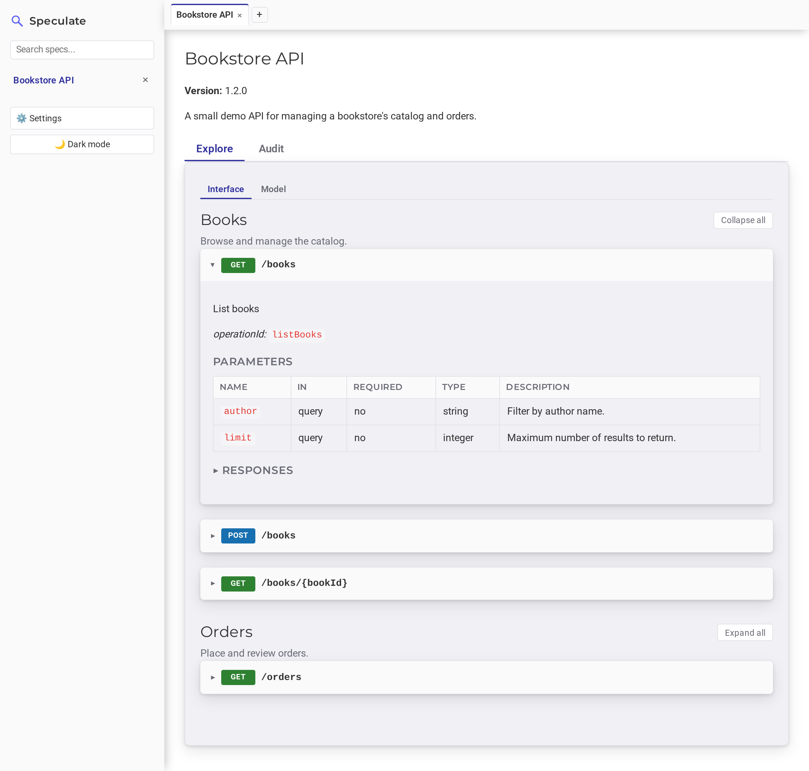

# Areté

Areté — the pursuit of API excellence.

  <a class="arete-button" href="https://github.com/johnjoeallen/arete/releases">Releases</a>
  <a class="arete-button arete-button-secondary" href="https://github.com/johnjoeallen/arete">GitHub</a>

Areté is a **local-first API explorer** for OpenAPI/Swagger specs. Paste a
spec, or point Areté at one on disk, and get instant browsable docs —
endpoints, parameters, schemas, request/response examples — plus pluggable,
policy-driven validation, with search, multi-spec tabs, and light/dark themes.

No cloud, no build step for the reader, no account: it's a single runnable jar
that keeps its data on your machine under `~/.arete`.

## What it does

Paste an OpenAPI or Swagger definition (JSON or YAML) into the textbox on the
home page and Areté parses it, saves it locally (keyed by the spec's
`title`, so re-pasting an updated version replaces it rather than piling up
duplicates), and renders it as browsable docs:

- Every path/method pair as a collapsible endpoint card, with HTTP-method
  colour coding and an expand/collapse-all toggle.
- Parameters (path, query, header, cookie) in a table with name, location,
  required/optional, type, and description.
- Request and response bodies as content-type tabs — one tab per media type in
  the spec (`application/json`, `application/xml`, …), plus an **Object** tab
  showing the schema as a collapsible property tree.
- Worked examples for each media type: the spec's own `example`/`examples` when
  present, otherwise one synthesised from the schema (respecting `enum`, common
  string `format`s like `date-time`/`email`/`uuid`, nested objects and arrays)
  and rendered in the right shape for that content type — pretty-printed JSON,
  XML, or `x-www-form-urlencoded`.
- `description` fields throughout the spec (info, tags, operations, parameters)
  render as Markdown, including any raw HTML they contain, sanitised for safe
  display.

### Load from disk and stay in sync

You don't have to paste — Areté can also load a spec straight from disk and
keep it current:

- Enter a file's full path in the *"load a file from elsewhere on disk"* field
  on the home page. Areté reads it immediately and then watches it, so
  saving a change updates the stored copy automatically.
- Drop a file into `~/.arete/specs` and Areté loads and watches it the
  same way, with no path to type. This folder is scanned on startup too, so
  files already sitting there when you launch get picked up.

Saved specs live in a sidebar you can search by title, which stays live — a
spec picked up by the file watcher appears there without a manual refresh.
Opening a spec adds it to a tab bar (kept in `localStorage`) so you can flip
between several open specs without losing your place; closing a tab just drops
it from the bar — the saved spec itself is untouched until you explicitly
delete it.

### Validation

Validation is **on-demand and pluggable**. Areté ships the
[Areté Policy Engine](validation/policy-engine.md) — a policy-driven plugin
that lints a spec against a bundle of text-defined rules and policies
(Enterprise Grade, Zalando, Zalando Extended) — and you can drop in your own
validation plugins alongside it. See
[Validation overview](validation/index.md).

## Next steps

- [Getting Started](getting-started.md) — install a release or build from source.
- [Configuration](configuration.md) — ports, data locations, launcher flags.
- [Validation overview](validation/index.md) — run validation and add plugins.
