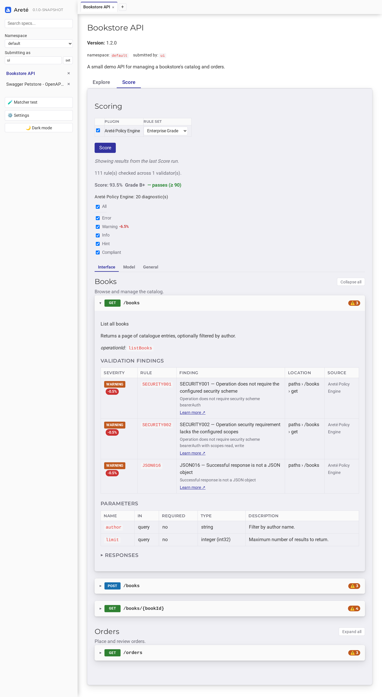

# Scoring

Scoring in Areté is **on-demand**. Opening a spec doesn't run anything by
itself — you choose what runs and when.

Areté scores with one engine, the
[**Areté Policy Engine**](policy-engine.md) (`generic-policy`), built into the
app. What changes between teams is the policy, not the engine: policies, rules
and matchers are plain text files.

## Running scoring

A **Scoring** picker on the spec's page lists every globally enabled plugin
as its own row — a checkbox plus that plugin's own policy dropdown — so more
than one plugin can run at once. Click **Score** to run every checked plugin;
nothing runs until you do.

Which plugins are checked is remembered **per spec** in the database, so
re-opening a spec later starts from the same selection. (A plugin's global
enabled/disabled state in **Settings** still governs whether it appears in the
picker at all.)

## Reading findings

Findings from every plugin that ran are merged into one view. Each endpoint
whose findings map to a specific operation shows a combined severity-count
badge (❌ error, ⚠️ warning, ℹ️ info, 💡 hint) in its header; expanding the
endpoint lists those findings in full:

- severity, rule ID, and the finding text
- the [JSON Pointer](https://www.rfc-editor.org/rfc/rfc6901) location
- which plugin reported it
- a **Learn more** link to the plugin's own rule documentation when it provides
  one

### Scores

A plugin may optionally report an overall compliance score (0–100) and, per
diagnostic, how many points fixing it would recover. Areté shows these as
percentages when present — but **only ever from a single plugin's scoring
model**. With more than one scoring plugin checked, the score is hidden rather
than combining two unrelated models into a meaningless number.

## Severity levels

Findings are tagged with one of four fixed `Severity` levels — `ERROR`,
`WARNING`, `INFO`, `HINT`. The **label** shown for each (on the severity filter
and in the findings table) comes from the plugin's `getSeverityLabel(Severity)`,
so a plugin can surface its own vocabulary (e.g. `Must` / `Should` / `May` /
`Hint`). The default simply title-cases the enum name.

## Policies

A plugin can declare more than one named policy — e.g. an
`internal` / `external` split for an organisation that lints differently by API
audience. Every enabled plugin gets its own row in the picker with its own
policy dropdown; a plugin with only the implicit default set just has one
entry.

A policy is a **plugin-chosen name**, not an engine-specific concept. The
Areté Policy Engine exposes one policy per bundled [policy](policies.md):
**Enterprise Grade** (the default), **Zalando**, and **Zalando Extended**.

!!! note "`getPolicies()` returns a `List`, not a `Set`"
    The picker submits a policy's **position** in the returned list, and the
    UI shows them in that order (preferred default first). A `Set.of(...)` with
    two or more elements has no iteration-order guarantee in Java, so policies
    would reshuffle on every restart. Keep the order stable across releases.

## Where the engine comes from

The engine is a dependency of the app, found on the classpath through Java's
`ServiceLoader` (`META-INF/services/net.dublinux.arete.engine.api.SpecScoringPlugin`).
There are no plugin jars to drop in and no plugin folders. The same engine is
a plain library (`arete-engine`) that other programs can embed.

Enable or disable individual plugins globally from **Settings**. A disabled
plugin stays loaded but never appears in a spec's picker and is skipped during
scoring, so re-enabling it doesn't need a restart. The per-spec checkbox is
a narrower, additional switch layered on top of the global setting.

## Next

- [Areté Policy Engine](policy-engine.md) — how the bundled plugin's
  matchers, rules, and policies work, and how to extend the bundle.
- [Rule Catalogue](rules.md) — every rule in the bundle and which policies use it.
- [Policies](policies.md) — the bundled Enterprise Grade, Zalando, and Zalando
  Extended policies.
